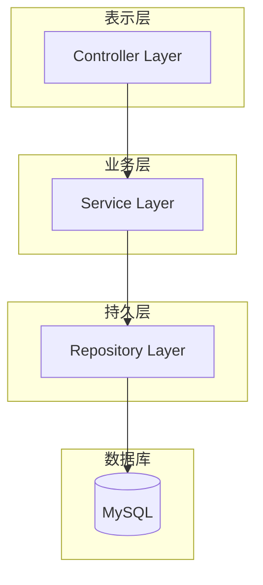

# {模块名称}概要设计文档(HLD)

## 1. 引言

### 1.1 编写目的
本文档描述{模块名称}的概要设计，包括系统架构、模块划分、接口设计和数据模型。

### 1.2 项目背景
{项目背景描述}

### 1.3 术语定义
- **聚合根**: DDD中的核心实体，作为数据修改的入口
- **值对象**: 不可变的对象，通过属性值来标识

## 2. 系统概述

### 2.1 系统目标
- {目标1}
- {目标2}
- {目标3}

### 2.2 系统范围
{模块名称}包含以下功能：
- {功能1}
- {功能2}
- {功能3}

### 2.3 系统架构



## 3. 系统设计

### 3.1 技术选型

| 技术组件 | 版本 | 说明 |
|---------|------|------|
| JDK | {jdkVersion} | Java开发工具包 |
| Spring Boot | {springBootVersion} | 基础框架 |
| MyBatis-Plus | 3.5.5 | ORM框架 |
| SpringDoc | 2.3.0 | API文档 |
| MapStruct | 1.5.5 | 对象转换 |

### 3.2 模块划分

| 模块 | 职责 | 依赖 |
|-----|------|------|
| controller | REST接口 | service |
| service | 业务逻辑 | repository |
| repository | 数据访问 | MySQL |

### 3.3 接口设计

#### {EntityName}相关接口

| 接口 | 方法 | 路径 | 说明 |
|-----|------|------|------|
| 创建{EntityName} | POST | /api/v1/{moduleName} | 创建新的{EntityName} |
| 查询{EntityName} | GET | /api/v1/{moduleName}/{id} | 查询{EntityName}详情 |
| 更新{EntityName} | PUT | /api/v1/{moduleName}/{id} | 更新{EntityName}信息 |
| 删除{EntityName} | DELETE | /api/v1/{moduleName}/{id} | 删除{EntityName} |
| {EntityName}列表 | GET | /api/v1/{moduleName} | 分页查询{EntityName}列表 |

### 3.4 数据模型

#### ER图

```mermaid
erDiagram
    {ENTITY_NAME} {
        bigint id PK
        varchar username
        varchar email UK
        datetime create_time
        datetime update_time
    }
```

#### 数据表清单

| 表名 | 说明 | 主要字段 |
|-----|------|---------|
| {tableName} | {EntityName}表 | id, {fields}, create_time, update_time |

## 4. 非功能需求

### 4.1 性能要求
- 单个接口响应时间 < 500ms
- 支持{并发数}并发用户

### 4.2 安全要求
- 接口需要认证授权
- 敏感信息脱敏处理
- 参数校验防止注入攻击

### 4.3 可靠性要求
- 系统可用性 99.9%
- 数据零丢失
