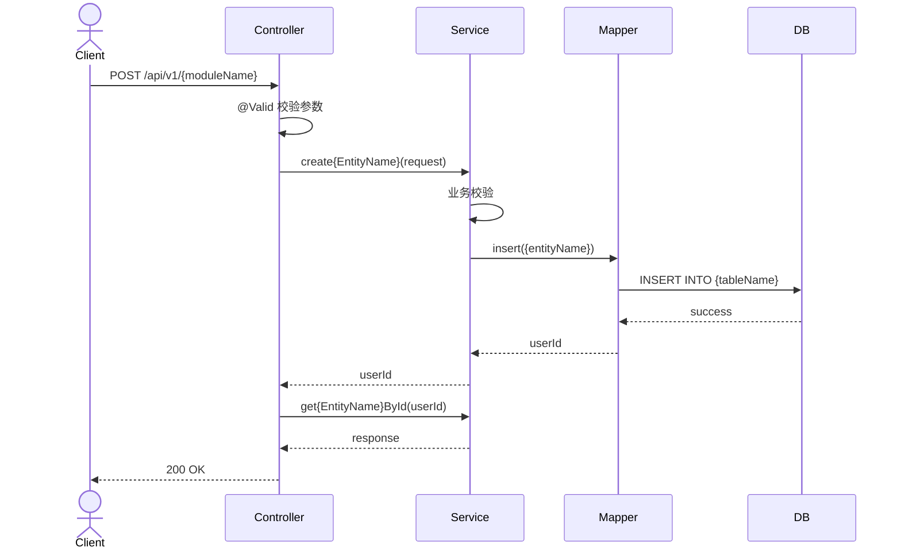
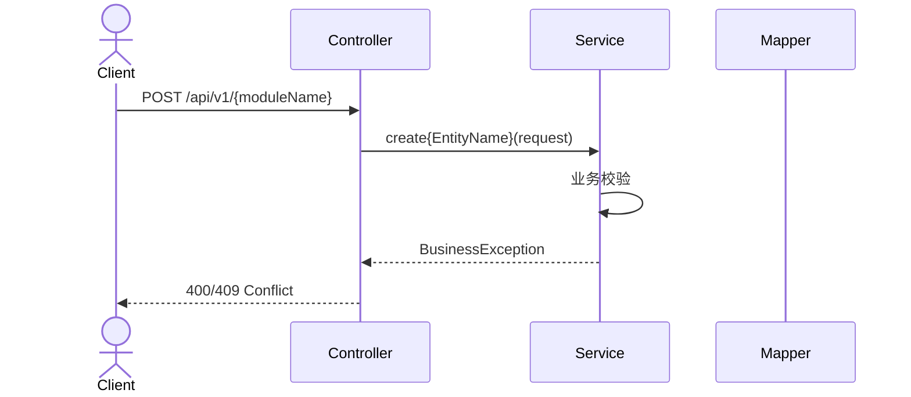

# {模块名称}详细设计文档(LLD)

## 1. 核心类图

```mermaid
classDiagram
    class {EntityName}Controller {
        +create{EntityName}(Request) Result
        +get{EntityName}ById(Long) Result
        +update{EntityName}(Long,Request) Result
        +delete{EntityName}(Long) Result
        +list{EntityName}s() Result
    }

    class {EntityName}Service {
        <<interface>>
        +create{EntityName}(Request) Long
        +get{EntityName}ById(Long) Response
        +update{EntityName}(Long,Request) void
        +delete{EntityName}(Long) void
        +list{EntityName}s() PageResult
    }

    class {EntityName}ServiceImpl {
        -{entityNameCamel}Mapper: {EntityName}Mapper
        -{entityNameCamel}Converter: {EntityName}Converter
        +create{EntityName}(Request) Long
        +get{EntityName}ById(Long) Response
    }

    class {EntityName}Mapper {
        <<interface>>
        +selectById(Long) {EntityName}
        +insert({EntityName}) int
        +updateById({EntityName}) int
    }

    class {EntityName} {
        -id: Long
        -{fields}
        -createTime: LocalDateTime
        -updateTime: LocalDateTime
        +getId() Long
    }

    class {EntityName}Converter {
        +toEntity(Request) {EntityName}
        +toResponse({EntityName}) Response
        +toResponseList(List) List
    }

    {EntityName}Controller --> {EntityName}Service
    {EntityName}Service <|-- {EntityName}ServiceImpl
    {EntityName}ServiceImpl --> {EntityName}Mapper
    {EntityName}ServiceImpl --> {EntityName}Converter
    {EntityName}Mapper ..|> BaseMapper
    {EntityName}Converter --> {EntityName}
```

## 2. 关键业务流程时序图

### 2.1 创建{EntityName}流程



### 2.2 异常流程



## 3. 核心算法逻辑

### 3.1 业务校验算法

```java
// 业务校验逻辑
public void validate{EntityName}({EntityName}CreateRequest request) {
    // TODO: 添加业务校验逻辑
}
```

## 4. 异常处理策略

### 4.1 异常分类

| 异常类型 | HTTP状态码 | 处理方式 |
|---------|-----------|---------|
| BusinessException | 400/409 | 返回错误信息给客户端 |
| NotFoundException | 404 | 返回资源不存在 |
| ValidationException | 400 | 返回字段校验错误 |
| Exception | 500 | 返回系统错误 |

## 5. 并发/事务设计

### 5.1 事务设计

| 方法 | 事务类型 | 说明 |
|-----|---------|------|
| create{EntityName} | @Transactional | 写操作 |
| update{EntityName} | @Transactional | 写操作 |
| delete{EntityName} | @Transactional | 写操作 |
| get{EntityName}ById | @Transactional(readOnly=true) | 读操作 |

### 5.2 并发控制

- 使用数据库唯一索引保证数据唯一性
- 使用乐观锁处理并发更新

## 6. 数据校验

### 6.1 Controller层校验

```java
@NotNull(message = "字段不能为空")
@Size(min = 2, max = 20, message = "字段长度2-20字符")
private String field;
```

### 6.2 Service层业务校验

```java
// 检查唯一性
checkUnique(request.getField());

// 检查状态
if (!{entityNameCamel}.isValid()) {
    throw new BusinessException("状态不允许该操作");
}
```
