# 结构图绘制指南

## Mermaid图表语法

### 1. 类图(Class Diagram)

#### 基本语法

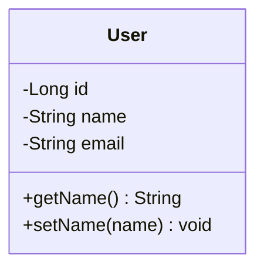

#### 关系语法

| 关系 | 语法 | 说明 |
|-----|------|-----|
| 继承 | `Child <|-- Parent` | 泛化关系 |
| 实现 | `Class ..|> Interface` | 实现接口 |
| 组合 | `Container *-- Component` | 强拥有 |
| 聚合 | `Aggregate o-- Component` | 弱拥有 |
| 关联 | `Class1 --> Class2` | 关联关系 |
| 依赖 | `Class1 ..> Class2` | 依赖关系 |

#### 完整示例

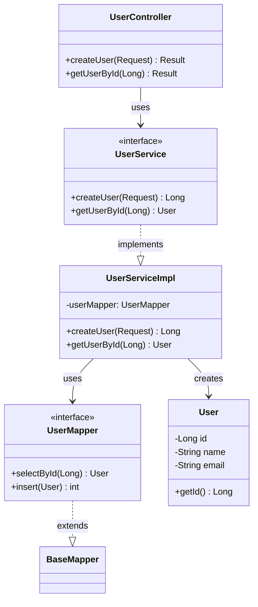

---

### 2. 时序图(Sequence Diagram)

#### 基本语法

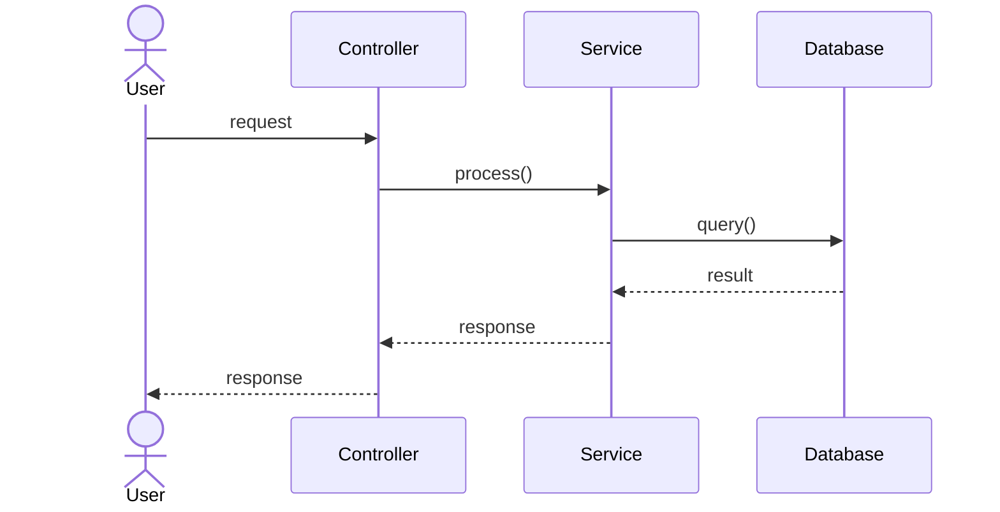

#### 完整示例

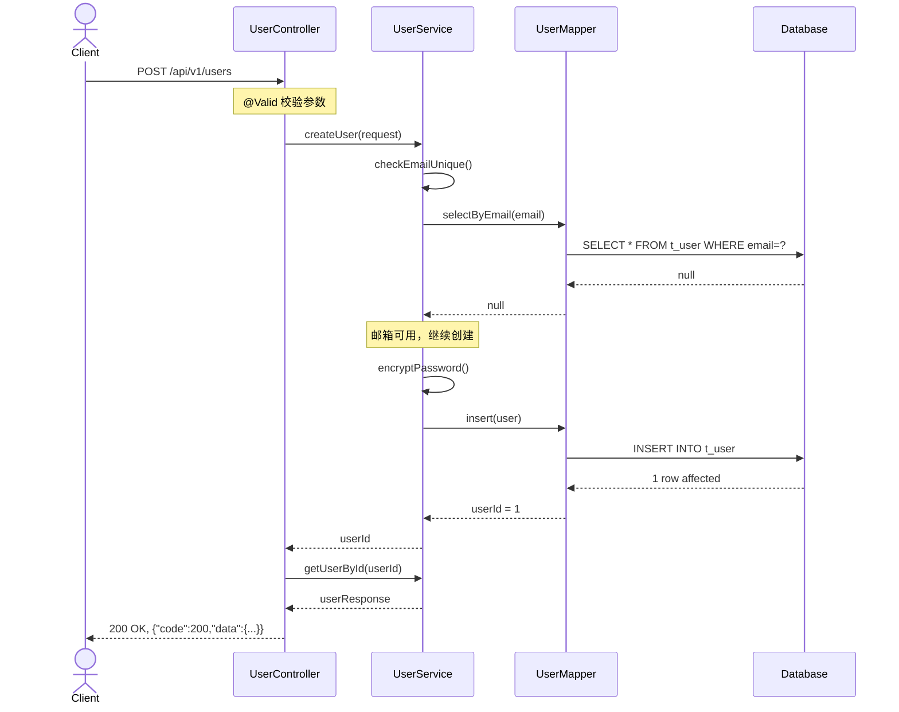

#### 异常流程

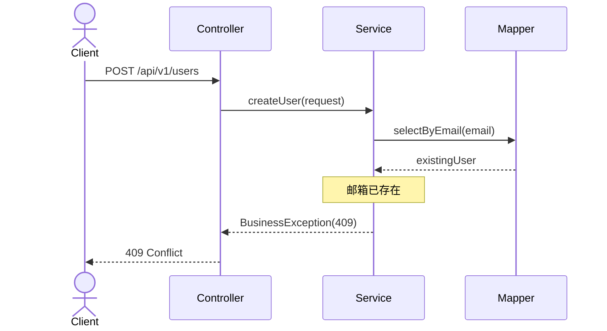

---

### 3. ER图(ER Diagram)

#### 基本语法

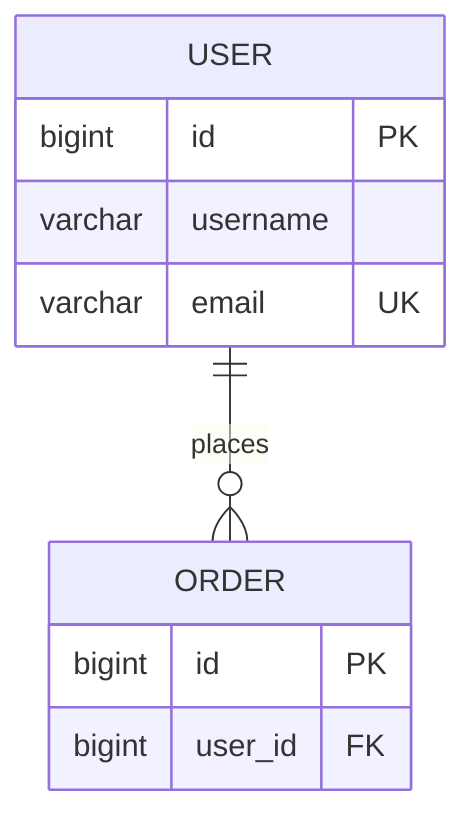

#### 关系类型

| 关系 | 语法 | 说明 |
|-----|------|-----|
| 一对一 | `A \|\| --o\|\| B` | 1:1 |
| 一对多 | `A \|\| --o\{ B` | 1:N |
| 多对多 | `A \} --o\{ B` | M:N |

#### 完整示例

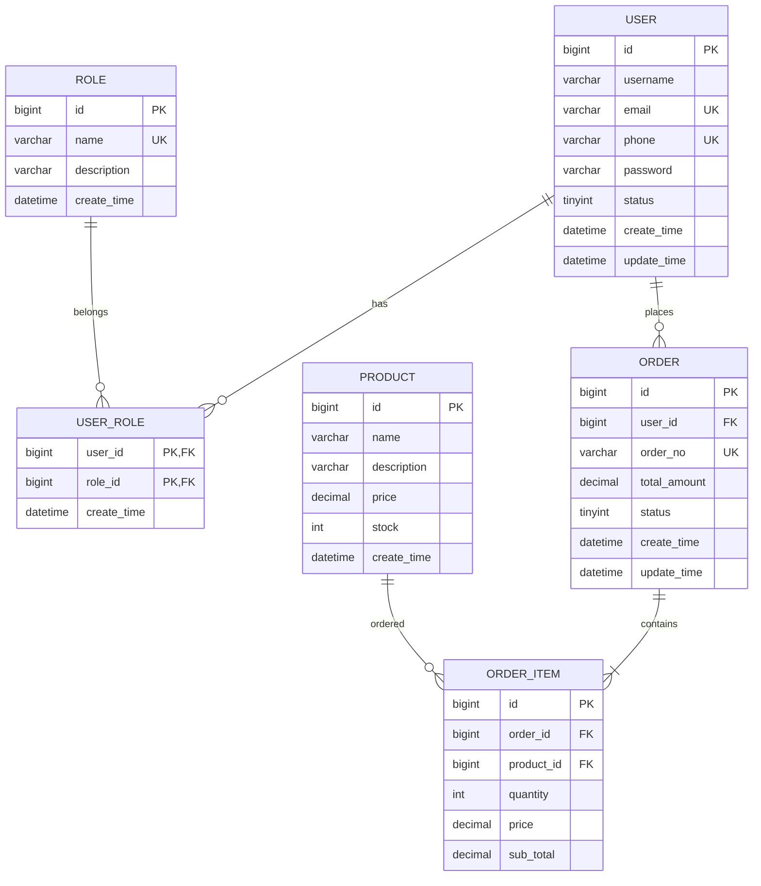

---

### 4. 状态图(State Diagram)

#### 基本语法

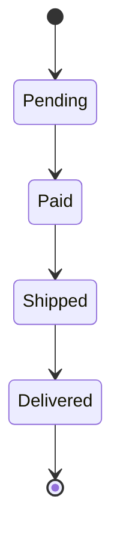

#### 完整示例

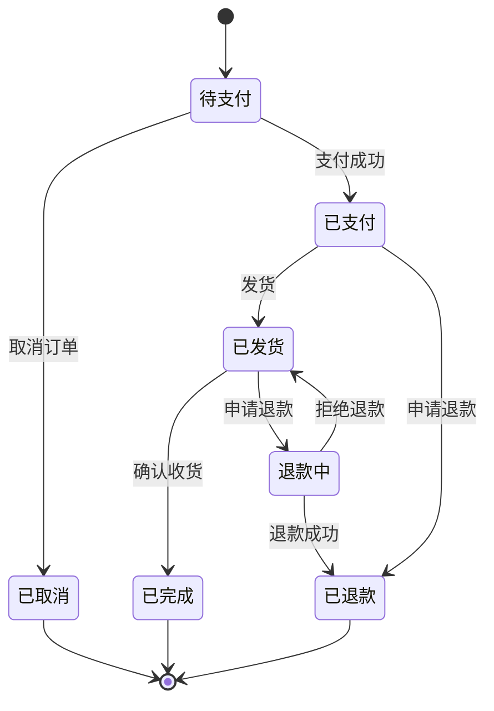

---

### 5. 部署图(Deployment Diagram)

#### 基本语法

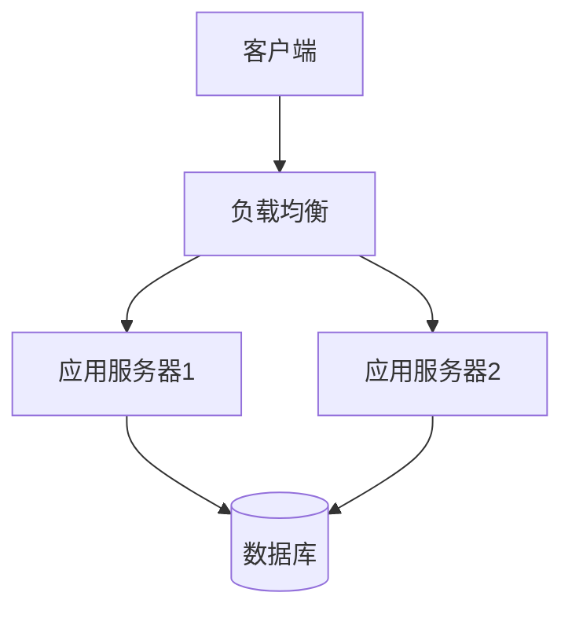

---

### 6. 分层架构图

#### 标准三层架构

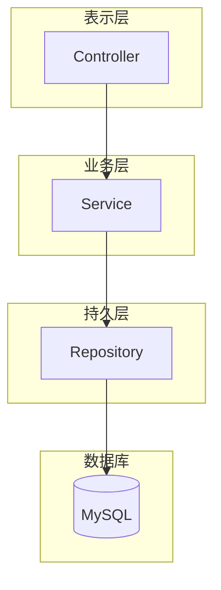

#### DDD分层架构

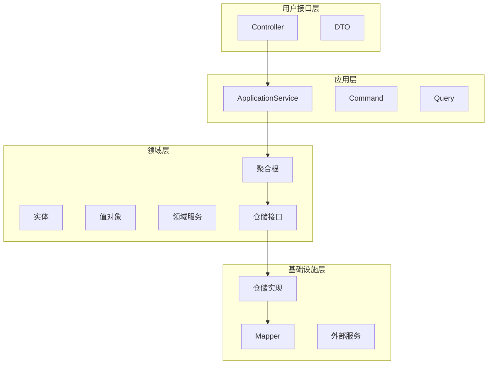

---

## 图表使用场景

### 1. 类图使用场景

- **概要设计**: 展示模块间的类关系
- **详细设计**: 展示类的属性和方法
- **代码评审**: 检查类的设计是否合理

### 2. 时序图使用场景

- **接口设计**: 展示接口调用流程
- **异常处理**: 展示异常场景的处理流程
- **事务边界**: 展示事务的开始和结束

### 3. ER图使用场景

- **数据建模**: 展示表结构和关系
- **需求分析**: 展示业务实体关系
- **数据库设计**: 指导DDL生成

### 4. 状态图使用场景

- **状态机设计**: 展示对象状态变化
- **业务流程**: 展示订单状态流转
- **工作流**: 展示审批流程

---

## Mermaid最佳实践

### 1. 语法规范

- **使用中文注释**: `Note over Component: 说明`
- **简洁明了**: 避免过多的元素
- **逻辑清晰**: 从上到下，从左到右
- **颜色区分**: 使用样式区分不同类型的元素

### 2. 样式定制

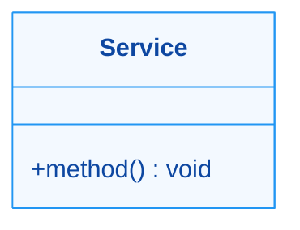

### 3. 常用样式

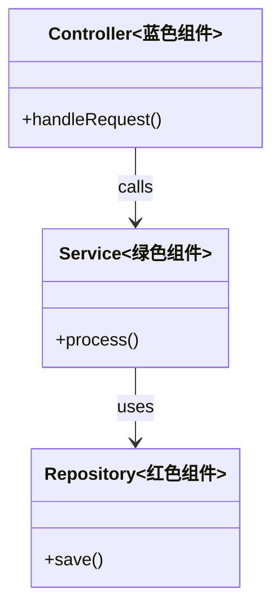

---

## 检查清单

### 类图
- [ ] 类名准确
- [ ] 属性和方法完整
- [ ] 关系类型正确
- [ ] 可见性符号正确

### 时序图
- [ ] 参与者完整
- [ ] 消息顺序正确
- [ ] 同步/异步消息区分
- [ ] 返回值明确

### ER图
- [ ] 表名和字段名正确
- [ ] 主键标识
- [ ] 外键标识
- [ ] 唯一索引标识
- [ ] 关系类型正确
