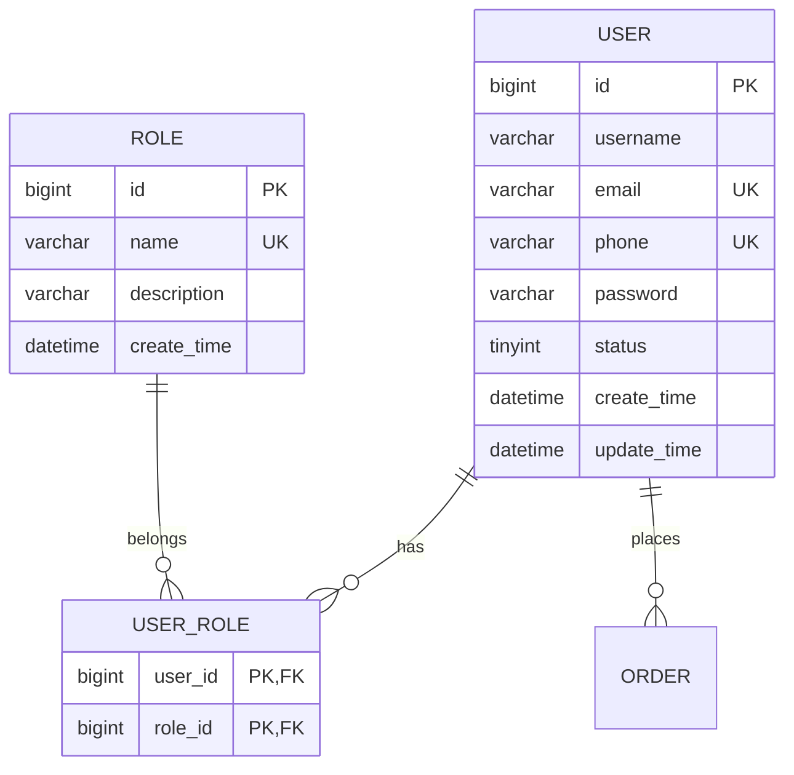
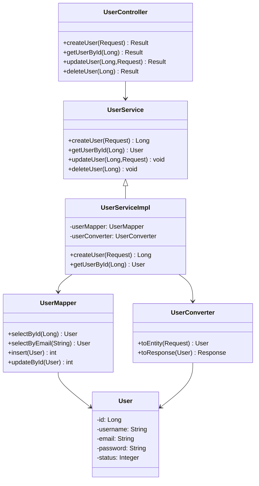
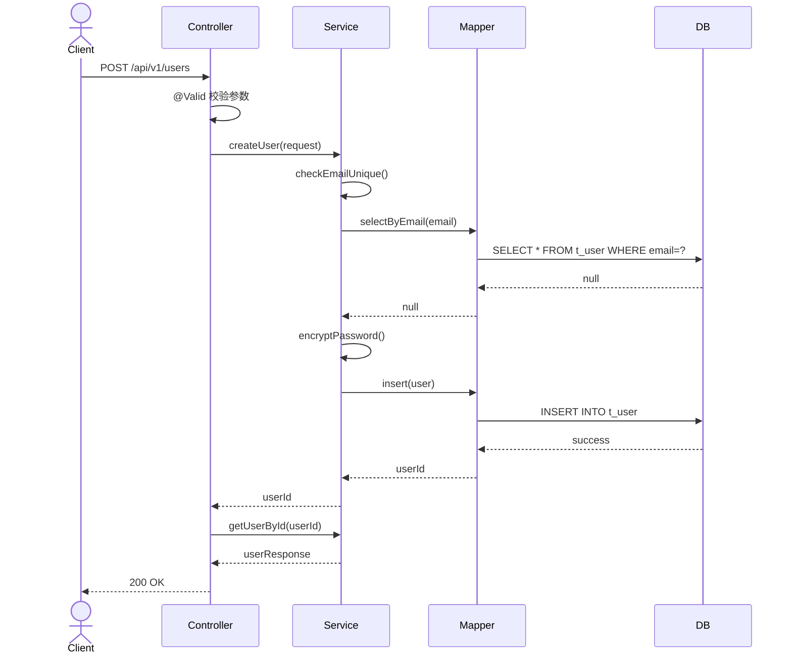
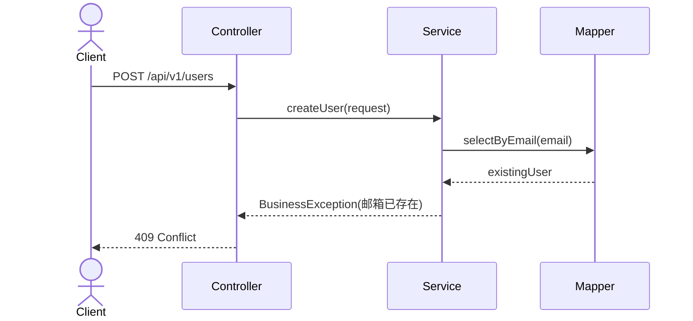

# 设计文档编写规范

## 概要设计文档(HLD)模板

### 1. 文档信息

```markdown
# {模块名称}概要设计文档

| 项目 | 内容 |
|-----|------|
| 文档版本 | v1.0 |
| 创建日期 | 2024-01-01 |
| 作者 | xxx |
| 审核人 | xxx |
| 状态 | 草稿/评审中/已发布 |
```

### 2. 文档变更记录

```markdown
## 变更记录

| 版本 | 日期 | 修改人 | 修改内容 |
|-----|------|--------|---------|
| v1.0 | 2024-01-01 | xxx | 初始版本 |
| v1.1 | 2024-01-05 | xxx | 新增XXX功能 |
```

### 3. 目录结构

```markdown
# 目录

1. [引言](#1-引言)
   1.1. [编写目的](#11-编写目的)
   1.2. [项目背景](#12-项目背景)
   1.3. [术语定义](#13-术语定义)
   1.4. [参考资料](#14-参考资料)

2. [系统概述](#2-系统概述)
   2.1. [系统目标](#21-系统目标)
   2.2. [系统范围](#22-系统范围)
   2.3. [系统架构](#23-系统架构)

3. [系统设计](#3-系统设计)
   3.1. [技术选型](#31-技术选型)
   3.2. [模块划分](#32-模块划分)
   3.3. [接口设计](#33-接口设计)
   3.4. [数据模型](#34-数据模型)

4. [非功能需求](#4-非功能需求)
   4.1. [性能要求](#41-性能要求)
   4.2. [安全要求](#42-安全要求)
   4.3. [可靠性要求](#43-可靠性要求)
```

### 4. HLD文档示例

```markdown
# 用户管理模块概要设计文档

## 1. 引言

### 1.1 编写目的
本文档描述用户管理模块的概要设计，包括系统架构、模块划分、接口设计和数据模型。

### 1.2 项目背景
用户管理模块是系统的基础模块，负责用户的注册、登录、信息管理等功能。

### 1.3 术语定义
- **聚合根**: DDD中的核心实体，作为数据修改的入口
- **值对象**: 不可变的对象，通过属性值来标识

### 1.4 参考资料
- 阿里巴巴Java开发手册
- Spring Boot官方文档

## 2. 系统概述

### 2.1 系统目标
- 提供用户注册、登录功能
- 支持用户信息管理
- 支持角色权限管理

### 2.2 系统范围
用户管理模块包含以下功能：
- 用户注册
- 用户登录
- 用户信息查询
- 用户信息修改
- 用户状态管理

### 2.3 系统架构

```
┌─────────────────────────────────────┐
│         Controller Layer            │
├─────────────────────────────────────┤
│         Service Layer               │
├─────────────────────────────────────┤
│         Repository Layer            │
├─────────────────────────────────────┤
│         MySQL Database              │
└─────────────────────────────────────┘
```

## 3. 系统设计

### 3.1 技术选型

| 技术组件 | 版本 | 说明 |
|---------|------|------|
| JDK | 17 | Long Term Support |
| Spring Boot | 3.2.0 | 基础框架 |
| MyBatis-Plus | 3.5.5 | ORM框架 |
| SpringDoc | 2.3.0 | API文档 |
| MapStruct | 1.5.5 | 对象转换 |

### 3.2 模块划分

| 模块 | 职责 | 依赖 |
|-----|------|------|
| user-controller | REST接口 | user-service |
| user-service | 业务逻辑 | user-repository |
| user-repository | 数据访问 | MySQL |

### 3.3 接口设计

#### 用户相关接口

| 接口 | 方法 | 路径 | 说明 |
|-----|------|------|------|
| 创建用户 | POST | /api/v1/users | 创建新用户 |
| 查询用户 | GET | /api/v1/users/{id} | 查询用户详情 |
| 更新用户 | PUT | /api/v1/users/{id} | 更新用户信息 |
| 删除用户 | DELETE | /api/v1/users/{id} | 删除用户 |
| 用户列表 | GET | /api/v1/users | 分页查询用户列表 |

### 3.4 数据模型

#### ER图



#### 数据表清单

| 表名 | 说明 | 主要字段 |
|-----|------|---------|
| t_user | 用户表 | id, username, email, phone, password, status |
| t_role | 角色表 | id, name, description |
| t_user_role | 用户角色关联表 | user_id, role_id |

## 4. 非功能需求

### 4.1 性能要求
- 单个接口响应时间 < 500ms
- 支持1000并发用户

### 4.2 安全要求
- 密码使用BCrypt加密存储
- 接口需要认证授权
- 敏感信息脱敏处理

### 4.3 可靠性要求
- 系统可用性 99.9%
- 数据零丢失
```

---

## 详细设计文档(LLD)模板

### 1. LLD文档示例

```markdown
# 用户管理模块详细设计文档

## 1. 核心类图



## 2. 关键业务流程时序图

### 2.1 创建用户流程



### 2.2 异常流程



## 3. 核心算法逻辑

### 3.1 密码加密算法

```java
// 使用BCrypt加密
String hashedPassword = BCrypt.hashpw(rawPassword, BCrypt.gensalt(12));

// 密码校验
boolean matches = BCrypt.checkpw(rawPassword, hashedPassword);
```

### 3.2 邮箱唯一性校验

```java
public void checkEmailUnique(String email) {
    LambdaQueryWrapper<User> wrapper = new LambdaQueryWrapper<>();
    wrapper.eq(User::getEmail, email);
    if (userMapper.selectCount(wrapper) > 0) {
        throw new BusinessException(ErrorCode.EMAIL_ALREADY_EXISTS);
    }
}
```

## 4. 异常处理策略

### 4.1 异常分类

| 异常类型 | HTTP状态码 | 处理方式 |
|---------|-----------|---------|
| BusinessException | 400/409 | 返回错误信息给客户端 |
| NotFoundException | 404 | 返回资源不存在 |
| ValidationException | 400 | 返回字段校验错误 |
| Exception | 500 | 返回系统错误 |

### 4.2 异常处理流程

```java
// Controller层不需要捕获异常，由全局异常处理器统一处理
public Result<UserResponse> createUser(@Valid @RequestBody UserCreateRequest request) {
    Long userId = userService.createUser(request);
    return Result.success(userService.getUserById(userId));
}

// 全局异常处理器
@RestControllerAdvice
public class GlobalExceptionHandler {
    @ExceptionHandler(BusinessException.class)
    public Result<Void> handleBusinessException(BusinessException e) {
        return Result.error(e.getCode(), e.getMessage());
    }
}
```

## 5. 并发/事务设计

### 5.1 事务设计

| 方法 | 事务类型 | 说明 |
|-----|---------|------|
| createUser | @Transactional | 写操作 |
| updateUser | @Transactional | 写操作 |
| deleteUser | @Transactional | 写操作 |
| getUserById | @Transactional(readOnly=true) | 读操作 |

### 5.2 并发控制

- 使用数据库唯一索引保证邮箱唯一性
- 使用乐观锁处理并发更新

```java
@Version
private Integer version;
```

## 6. 数据校验

### 6.1 Controller层校验

```java
@NotNull(message = "用户名不能为空")
@Size(min = 2, max = 20, message = "用户名长度2-20字符")
private String username;

@Email(message = "邮箱格式不正确")
private String email;
```

### 6.2 Service层业务校验

```java
// 检查邮箱唯一性
checkEmailUnique(request.getEmail());

// 检查用户状态
if (!user.isActive()) {
    throw new BusinessException("用户已被禁用");
}
```
```

---

## 文档编写规范

### 1. 编写原则

- **简洁明了**: 避免冗余描述
- **图文并茂**: 使用图表辅助说明
- **版本控制**: 记录变更历史
- **评审机制**: 设计评审后更新

### 2. 图表规范

- **架构图**: 使用分层架构图
- **类图**: 使用Mermaid类图
- **时序图**: 使用Mermaid时序图
- **ER图**: 使用Mermaid ER图

### 3. 接口描述规范

```markdown
### 创建用户

**接口路径**: POST /api/v1/users

**请求参数**:
```json
{
  "username": "zhangsan",
  "email": "zhangsan@example.com",
  "password": "Password123"
}
```

**响应示例**:
```json
{
  "code": 200,
  "message": "操作成功",
  "data": {
    "id": 1,
    "username": "zhangsan",
    "email": "zhangsan@example.com"
  }
}
```

**错误码**:
- 400: 参数错误
- 409: 邮箱已存在
```

### 4. 检查清单

- [ ] 文档版本号
- [ ] 变更记录
- [ ] 系统架构图
- [ ] 接口清单
- [ ] 数据模型图
- [ ] 核心流程时序图
- [ ] 异常处理说明
- [ ] 性能指标
- [ ] 安全要求
