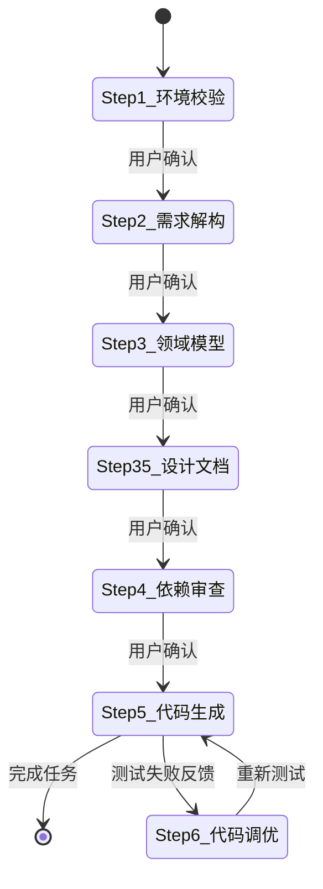

# 6步强制交互工作流SOP

## 核心原则

**绝对规则**：任务必须拆解为 6 个阶段，每个阶段输出完毕后**必须停止生成（Halt Generation）**，向用户发起提问。禁止擅自进入下一阶段。

---

## 状态机图



---

## Step 1: 环境基建校验

### 动作清单
- [ ] 嗅探当前工程上下文
- [ ] 确认 JDK 版本
- [ ] 确认 Spring Boot 版本
- [ ] 确认数据库类型（MySQL/PostgreSQL/Redis 等）
- [ ] 确认是否有其他中间件约束

### 停止提问模板
```
请确认上述环境基准是否正确？是否有其他中间件约束？
```

### 输出示例
```
【环境基准校验】

- JDK版本: 17
- Spring Boot版本: 3.2.0
- 数据库: MySQL 8.0
- 缓存: Redis 7.0
- 消息队列: 无

请确认上述环境基准是否正确？是否有其他中间件约束？
⏸️ 停止生成，等待用户回复
```

---

## Step 2: 需求深度解构

### 动作清单
- [ ] 用 DDD（领域驱动设计）视角复述核心业务逻辑
- [ ] 识别核心实体（Aggregate Root）
- [ ] 识别值对象（Value Object）
- [ ] 识别领域服务（Domain Service）
- [ ] 主动指出 2-3 个潜在的边界条件或异常场景
- [ ] 识别 CRUD 操作
- [ ] 识别自定义业务方法

### 停止提问模板
```
以上需求理解与边界预判是否准确？有无补充？
```

### 输出示例
```
【需求深度解构 - DDD视角】

核心领域: 用户管理

聚合根: User (用户实体)

值对象:
- Email (邮箱值对象，带格式验证)
- PhoneNumber (手机号值对象，带格式验证)

领域服务:
- UserRegistrationService (用户注册服务)
- UserUniqueService (用户唯一性校验服务)

CRUD操作:
- 创建用户 (POST /api/v1/users)
- 查询用户 (GET /api/v1/users/{id})
- 更新用户 (PUT /api/v1/users/{id})
- 删除用户 (DELETE /api/v1/users/{id})
- 查询用户列表 (GET /api/v1/users)

自定义业务方法:
- 禁用/启用用户 (POST /api/v1/users/{id}/status)
- 修改密码 (POST /api/v1/users/{id}/password)
- 重置密码 (POST /api/v1/users/{id}/password/reset)

边界条件与异常场景:
1. 邮箱重复校验: 创建用户时需要检查邮箱是否已存在
2. 手机号重复校验: 创建用户时需要检查手机号是否已存在
3. 用户状态校验: 禁用的用户不能进行业务操作

以上需求理解与边界预判是否准确？有无补充？
⏸️ 停止生成，等待用户回复
```

---

## Step 3: 领域模型与数据结构

### 动作清单
- [ ] 输出数据库表结构设计（DDL 草稿）
- [ ] 输出核心字段说明
- [ ] 设计索引（普通索引、唯一索引、联合索引）
- [ ] 设计关联关系（一对一、一对多、多对多）
- [ ] 输出 Java 实体类 (Entity) 设计
- [ ] 定义字段映射关系

### 停止提问模板
```
表结构与实体设计是否满足业务未来扩展性？是否同意该设计？
```

### 输出示例
```
【领域模型与数据结构设计】

-- 用户表 (t_user)
CREATE TABLE t_user (
    id              BIGINT          NOT NULL AUTO_INCREMENT COMMENT '主键ID',
    username        VARCHAR(50)     NOT NULL COMMENT '用户名',
    email           VARCHAR(100)    NOT NULL COMMENT '邮箱',
    phone           VARCHAR(20)     NULL     COMMENT '手机号',
    password        VARCHAR(200)    NOT NULL COMMENT '密码(加密)',
    status          TINYINT         NOT NULL DEFAULT 1 COMMENT '状态:1-正常,0-禁用',
    create_time     DATETIME        NOT NULL DEFAULT CURRENT_TIMESTAMP COMMENT '创建时间',
    update_time     DATETIME        NOT NULL DEFAULT CURRENT_TIMESTAMP ON UPDATE CURRENT_TIMESTAMP COMMENT '更新时间',
    PRIMARY KEY (id),
    UNIQUE KEY uk_email (email),
    UNIQUE KEY uk_phone (phone),
    KEY idx_username (username),
    KEY idx_status (status)
) ENGINE=InnoDB DEFAULT CHARSET=utf8mb4 COMMENT='用户表';

-- 索引说明
- PRIMARY KEY: 主键索引
- uk_email: 邮箱唯一索引（业务要求邮箱唯一）
- uk_phone: 手机号唯一索引（业务要求手机号唯一）
- idx_username: 用户名普通索引（用于登录查询）
- idx_status: 状态普通索引（用于列表筛选）

【Java实体类设计】

@Data
@TableName("t_user")
public class User {
    @TableId(type = IdType.AUTO)
    private Long id;

    @TableField("username")
    private String username;

    @TableField("email")
    private String email;

    @TableField("phone")
    private String phone;

    @TableField("password")
    private String password;

    @TableField("status")
    private Integer status;

    @TableField("create_time")
    private LocalDateTime createTime;

    @TableField("update_time")
    private LocalDateTime updateTime;
}

表结构与实体设计是否满足业务未来扩展性？是否同意该设计？
⏸️ 停止生成，等待用户回复
```

---

## Step 3.5: 设计文档生成

### 动作清单
- [ ] 输出概要设计文档（HLD）
  - [ ] 系统架构图（分层架构）
  - [ ] 模块划分与职责
  - [ ] 核心接口设计（RESTful API列表）
  - [ ] 数据模型关系图（ER图）
  - [ ] 技术选型说明
- [ ] 输出详细设计文档（LLD）
  - [ ] 核心类图
  - [ ] 关键业务流程时序图
  - [ ] 核心算法逻辑说明
  - [ ] 异常处理策略
  - [ ] 并发/事务设计

### 停止提问模板
```
概要设计与详细设计是否满足要求？是否需要调整？
```

---

## Step 4: 依赖与组件审查

### 动作清单
- [ ] 评估是否需要引入新的第三方库
- [ ] 如需要，提供精确的 Maven `pom.xml` 依赖片段
- [ ] 如需要，提供 `application.yml` 配置变更说明
- [ ] 说明依赖用途和版本选择理由

### 停止提问模板
```
是否允许引入上述依赖？或确认无需新增依赖？
```

### 输出示例
```
【依赖与组件审查】

需要新增以下依赖:

```xml
<!-- MyBatis-Plus -->
<dependency>
    <groupId>com.baomidou</groupId>
    <artifactId>mybatis-plus-boot-starter</artifactId>
    <version>3.5.5</version>
</dependency>

<!-- SpringDoc OpenAPI (Swagger) -->
<dependency>
    <groupId>org.springdoc</groupId>
    <artifactId>springdoc-openapi-starter-webmvc-ui</artifactId>
    <version>2.3.0</version>
</dependency>

<!-- MapStruct -->
<dependency>
    <groupId>org.mapstruct</groupId>
    <artifactId>mapstruct</artifactId>
    <version>1.5.5.Final</version>
</dependency>
```

需要修改 application.yml:

```yaml
mybatis-plus:
  configuration:
    map-underscore-to-camel-case: true
    log-impl: org.apache.ibatis.logging.stdout.StdOutImpl
  global-config:
    db-config:
      id-type: auto
      logic-delete-field: deleted
      logic-delete-value: 1
      logic-not-delete-value: 0

springdoc:
  api-docs:
    path: /v3/api-docs
  swagger-ui:
    path: /swagger-ui.html
```

是否允许引入上述依赖？或确认无需新增依赖？
⏸️ 停止生成，等待用户回复
```

---

## Step 5: 工业级代码落地与自测

### 动作清单（获得前四步全部授权后）
- [ ] 生成设计文档：概要设计（HLD）+ 详细设计（LLD）
- [ ] 生成完整分层代码（严格遵循 Code Style）
- [ ] 生成全覆盖单元测试（JUnit 4 + Mockito）
- [ ] 生成Postman测试集合（请求Header、Body、参数）
- [ ] 生成测试数据SQL（如自动生成表结构）
- [ ] 输出代码清单和 API 文档
- [ ] 建议单元测试方案

### 闭环汇报模板
```
【任务完成汇报】

✅ 代码生成完成

生成文件清单:
1. 实体类: User.java
2. Mapper接口: UserMapper.java
3. Service接口: UserService.java
4. Service实现: UserServiceImpl.java
5. Controller: UserController.java
6. DTO: UserCreateRequest.java, UserResponse.java
7. 转换器: UserConverter.java
8. 异常类: UserNotFoundException.java
9. 测试类: UserServiceTest.java, UserControllerTest.java
10. Postman集合: user-management.postman_collection.json
11. 测试数据: test_data.sql

API接口列表:
- POST   /api/v1/users           创建用户
- GET    /api/v1/users/{id}      查询用户
- PUT    /api/v1/users/{id}      更新用户
- DELETE /api/v1/users/{id}      删除用户
- GET    /api/v1/users           查询用户列表
- POST   /api/v1/users/{id}/status   修改用户状态

下一步建议:
1. 执行 test_data.sql 初始化测试数据
2. 运行单元测试验证功能
3. 导入Postman集合进行接口测试
4. 使用IDEA的代码检查功能扫描代码规范
```

---

## Step 6: 测试驱动的代码调优（可选）

### 触发条件
用户主动反馈测试问题

### 必需信息
```
需求名称: {需求标识符}
测试用例: {具体测试场景}
输入: {测试输入数据}
期望输出: {期望的结果}
实际输出: {实际的结果/错误信息}
```

### 输出格式
```
【需求】user-management

问题分析：{问题分析}

需要修改的代码位置：
{文件路径}:{行号}

原代码：
```java
{原代码内容}
```

替换为：
```java
{修改后的代码}
```

请按上述说明修改代码后重新测试。
```

---

## 执行检查清单

每步完成后检查：
- [ ] 是否输出完整内容
- [ ] 是否明确提出停止问题
- [ ] 是否等待用户回复
- [ ] 未获得确认不进入下一步

---

## 常见错误规避

### 错误1: 一次性输出所有步骤
❌ 错误行为: 将6步内容一次性输出
✅ 正确行为: 每步输出后停止，等待用户确认

### 错误2: 停止问题不明确
❌ 错误行为: "接下来做什么？"
✅ 正确行为: "表结构与实体设计是否满足业务未来扩展性？是否同意该设计？"

### 错误3: 未经确认继续下一步
❌ 错误行为: 输出Step 1后直接输出Step 2
✅ 正确行为: 输出Step 1后明确停止，等待用户回复

---

## 调试技巧

如果发现没有收到用户回复：
1. 检查是否提出了明确的停止问题
2. 检查问题是否有"是否"、"有无"等确认性词汇
3. 确保有 "⏸️ 停止生成，等待用户回复" 标识
